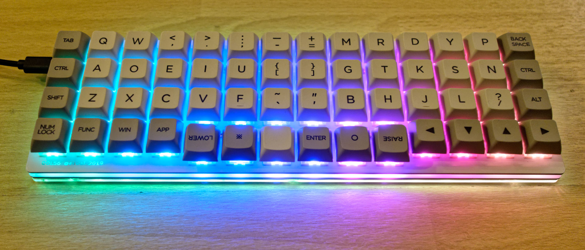
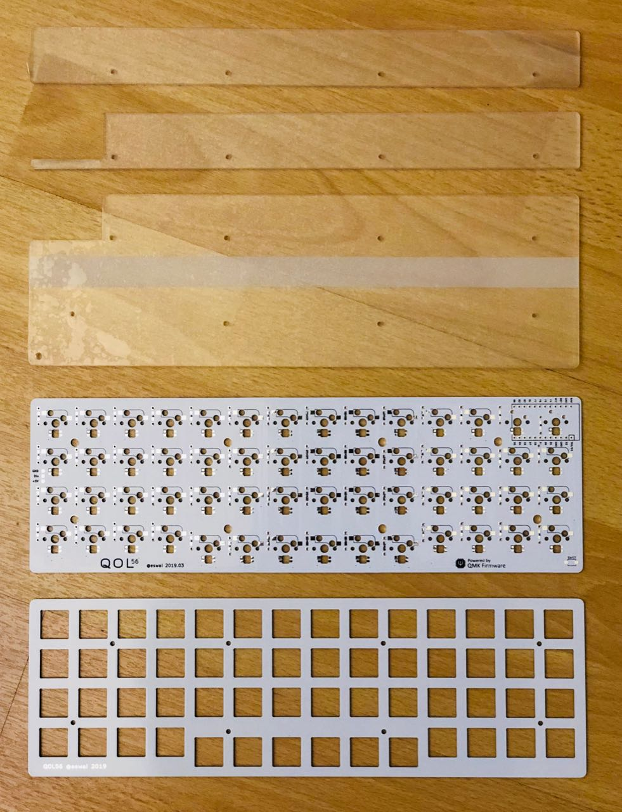
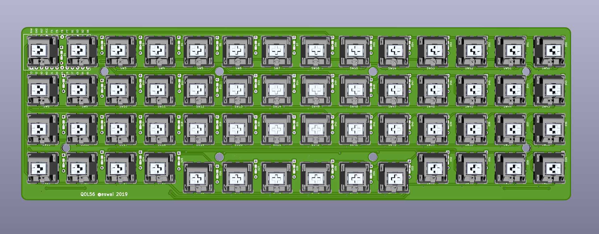
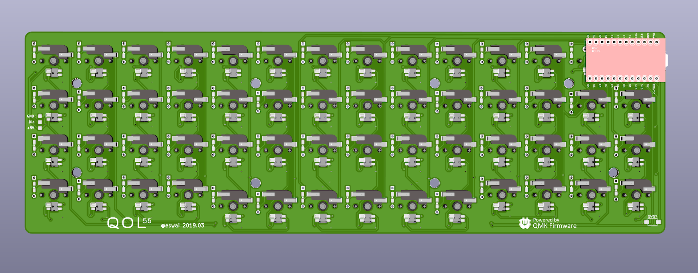
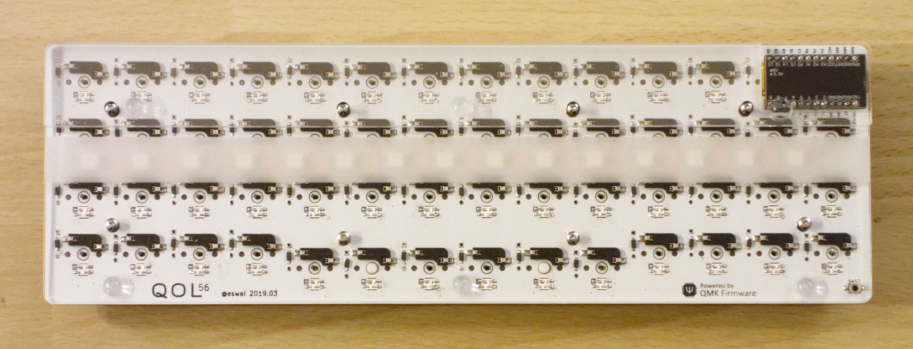
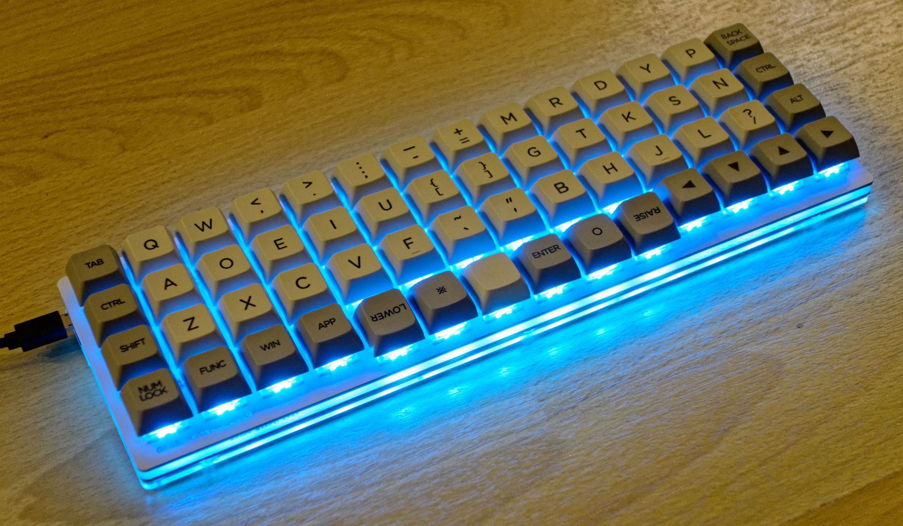
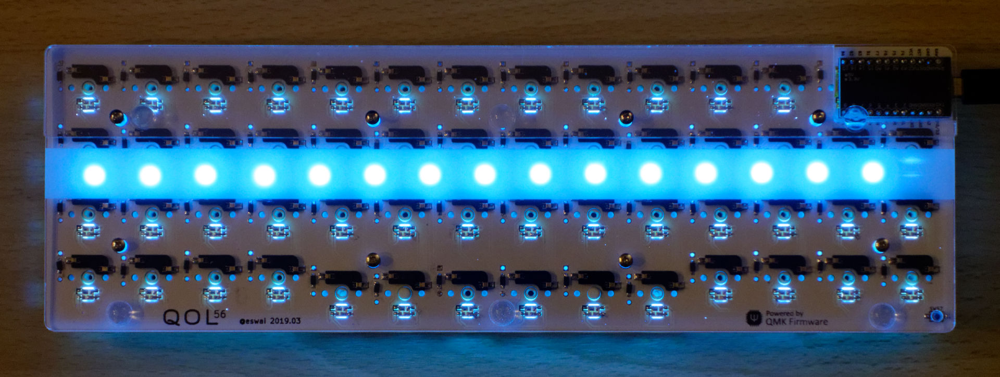
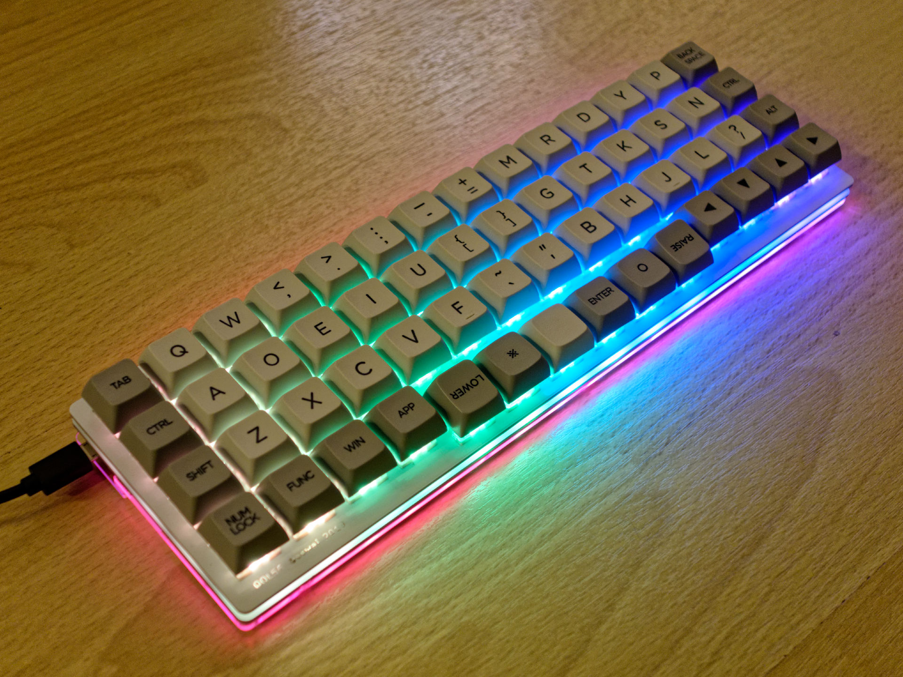

# QOL56

## 特徴

QOL56は、ほぼ直交格子配列(ortholinear)な56キーのキーボードです。
ortholinearキーボードはplanckが有名ですが、planckよりも2列、8キー多い配列です。
親指で自然に押せるキーを6キー配置すると必然的に14列必要になりました。
その結果、親指でシフト、スペース、エンター、レイヤー切り替えなど頻度の高いキー操作が可能です。
また、親指シフト入力での使用を念頭において設計しており、現在の親指シフト入力をする上での様々な課題を解決し、最新のキーボードトレンドを取り込んで、接続するだけで快適に親指シフト入力できることを目指すキーボードです。

## 親指シフト入力に対応

親指シフト入力のユーザーは、高価な専用キーボードを購入したり、いわゆるB割れしているキーボードを探したり、orz配列という右手のキーを1列ずらすなどの努力をしていますが、自作することで親指シフトに最適なキーボードを実現することが目的です。
同時に旧来のrow staggeredの非対称キー配置から脱却し、より効率の良い配列へ移行することもめざしています。
親指シフトなどの同時押しでは特にキー配置が左右対称であるべきだと考えています。
もっとエルゴノミックなキー配列はたくさんあるのですが、まずはシンプルで扱いやすそうな直交格子配列にしてみました。
親指との同時押しが快適にできるように親指で押す6キーを0.25U下げて配置しています。

さらに親指シフト入力をするために通常は追加でソフトウェアのインストールが必要です。
親指シフトするためのソフトとして、例えばやまぶきRやLacailleなどのソフトがあります。
自作キーボード用のファームウェアQMKは非常に高機能なので、ファームウェアレベルでの親指シフト入力をサポートしました。
追加ソフトなしでの親指シフトの入力が可能です。

## LED

バックライトやアンダーグロウのLEDはかっこよくて所有欲を満たしてくれるものですので、71個(バックライト56個、アンダーグロー15個)のフルカラーLEDを搭載して、QMKのアニメーションをフルに楽しめるようになっています。

## 実装面での特徴

* Pro Microをキー下に配置してフットプリントを最小化
* Pro Microと重ならない54キーはソケットを採用してキースイッチを交換可能にした
* コンスルー対応で、Pro Microの脱着が可能
* チルトさせることで全体が厚くならないように配慮

## 制作について

キット販売などはないので、PCBなどの部品をメーカーに制作してもらう必要がありますが、ガーバーファイルやアクリルカットのためのepsファイルを公開しています。
決して初心者向きではありませんが、ある程度知識があれば容易に部品の調達は可能です。

部品一覧表

|部品名|仕様|数量|
|---|---|---|
|PCBトッププレート|1.6mm|1|
|PCB基板|1.6mm|1|
|アクリルボトムプレート3種類|2mm|1 set|
|キースイッチ|MX互換|56|
|キーキャップ|1U|56|
|ねじ|M2 x 4mm|12|
|ねじ|M2 x 10mm|4|
|スペーサ|M2 x 7mm|8|
|Pro Micro|ATmega32U4 5V 16MHz|1|
|ダイオード|1N4148Wまたは1N4148|56|
|Kailh PCB Socket|CPG151101S11|54|
|タクトスイッチ|2極 SMD 4x3x2mm|1|

LEDを付ける場合は以下の部品を用意します。なくても動作します。

|部品名|仕様|数量|
|---|---|---|
|LED|SK6812 mini 3535|56|
|LEDテープ|WS2812|25cm 15個|

参考価格ですが、elecrowにPCB、トッププレート、ボトムプレートの3点をオーダーしましたが、最小単位の5セット、送料込みで$100以下でした。
他にはCherry MX互換のスイッチ、キーキャップ、Pro Micro、ダイオード、ソケット、M2ねじなど自作キーボードでは一般的な部品を採用しています。
また、kicadファイルも公開していますので、自由に改造して自分好みのレイアウトを作っていただくことも可能です。
QMKのコードは [GitHub](https://github.com/eswai/qmk_firmware/tree/master/keyboards/eswai/qol56) にありますので、キーマップの修正が可能です。

